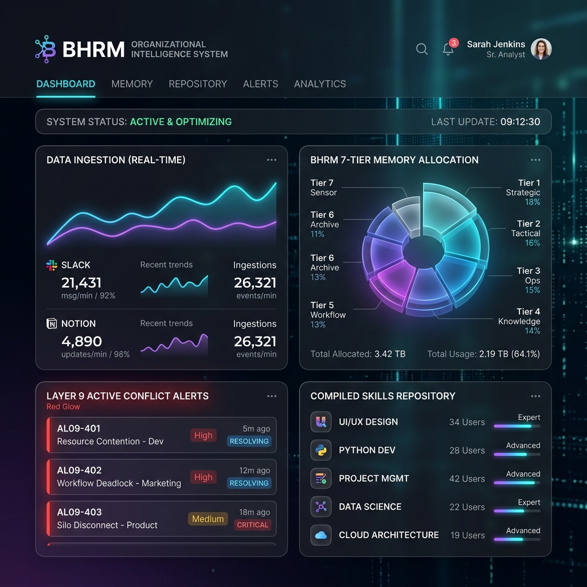
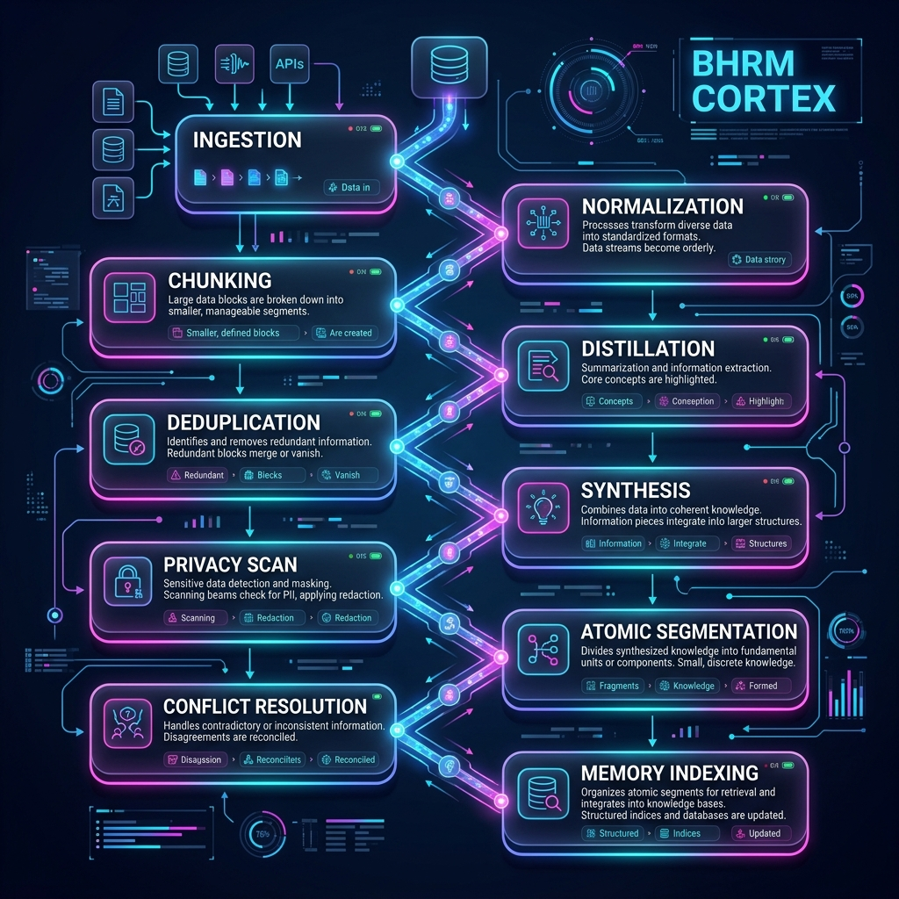
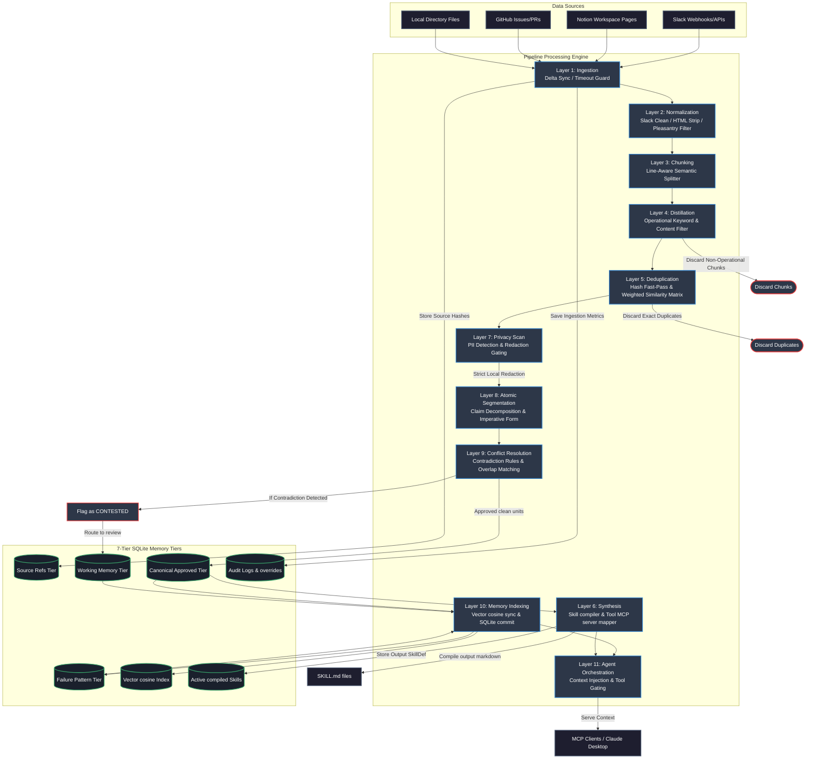
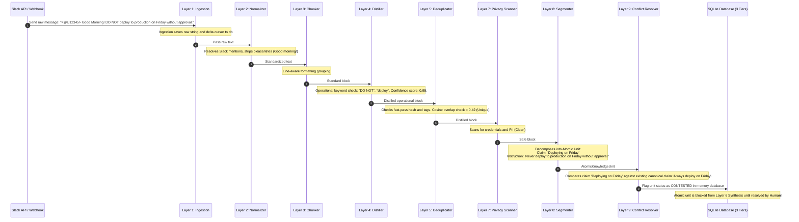
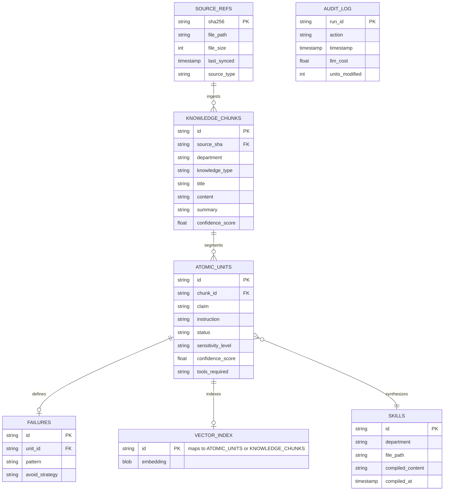
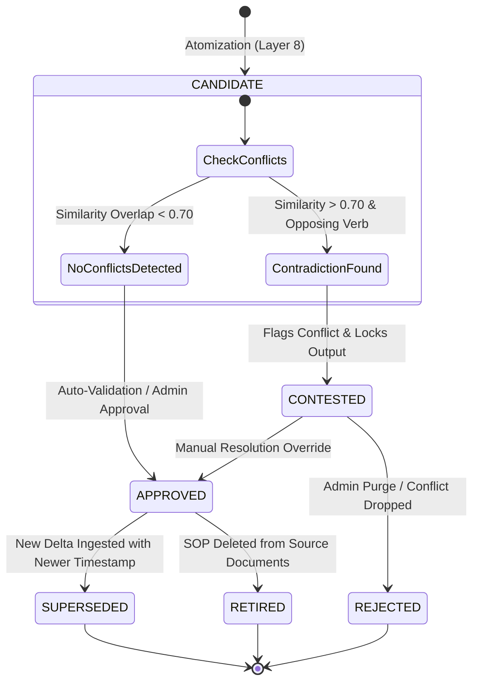

# BHRM Organizational Intelligence Engine
## 11-Layer Architecture, Core Schemas, and System Stabilization Reference Manual

This comprehensive reference manual documents the architecture, data models, integration layers, and algorithmic engines of the **BHRM Organizational Intelligence Engine** (Cortex). It serves as both a high-level system guide for engineers and a deep-dive technical blueprint for maintaining, expanding, and auditing the system.

---

## 1. Executive Summary & Purpose

The BHRM Organizational Intelligence Engine is a high-performance, resilient, and multi-layered pipeline designed to ingest unstructured operational data from heterogeneous company sources (Slack, Notion, GitHub, local files, linear tickets), standardize and sanitize it, extract actionable operational "signals", run conflict resolution on contradicting claims, and compile these signals into formal, executable **Skills** and **Tool Provisioning rules** for AI agents.

### Core Value Proposition
- **Structured Knowledge from Noise**: Transforms messy slack chatter and lengthy Notion pages into discrete, high-confidence instructions.
- **Strict Data Integrity**: Ensures no duplicates, personal blog posts, or contradicting statements pollute the AI agent memory.
- **PII and Secret Protection**: Automatic Layer 7 scanning and local-redaction guarantees confidential data never leaks to online LLMs.
- **7-Tier Memory Management**: Separates working, canonical, source, vector, and failure memory to build a complete, traceable audit log of all system decisions.
- **Agent Orchestration**: Dynamically gates tools and context for registered MCP agents.



---

## 2. The 11-Layer Architecture & Processing Flow

The BHRM pipeline processes data through 11 distinct, sequential layers to guarantee safety, coherence, and accuracy. Below is a high-fidelity visual blueprint of the architecture mapping out the data flow from ingestion to memory tiers and agents.



### End-to-End Ingestion & Processing Flow

Here is the detailed functional flow diagram of the Cortex processing pipeline, tracing data from external connectors to vector storage and compiled skills:



---

### Step-by-Step Layer Details & Specifications

### Layer 1: Ingestion
* **Purpose**: Aggregates raw text and messages from connected systems.
* **Mechanism**:
  * **ConnectorManager**: Connects OAuth and token-based endpoints, managing a local sync state in SQLite.
  * **Delta Synchronization**: Employs `fetch_delta()` using sync cursors or Unix timestamps to only ingest updated documents.
  * **Zero-Setup Connectors**: Includes direct terminal-based scanning (like `gh cli` checks and local directories).
  * **Timeout Safeguard**: Wraps third-party API calls in a strict `_timeout(30)` context manager to prevent pipeline hangs due to network failures.

### Layer 2: Normalization
* **Purpose**: Cleans and standardizes raw text, removing noise that distracts downstream AI.
* **Standardizations**:
  * **HTML Cleansing**: Strips all HTML tags and normalizes excessive spaces.
  * **Slack Artifact Clean**: Replaces user mentions with generic `[user]` templates, resolves channel links (`<#C123|engineering-deployments>` $\rightarrow$ `#engineering-deployments`), and strips standalone emoji lines while preserving inline punctuation like `:warning:`.
  * **Pleasantry Filter**: Strips lines starting with non-operational pleasantries ("good morning", "happy birthday", "thanks", "lol") while preserving any line that carries an operational keyword.

### Layer 3: Chunking
* **Purpose**: Breaks documents into manageable blocks for the LLM context window without losing meaning.
* **Line-Aware Strategy**:
  * Splits text exclusively on **line and paragraph breaks**. It never cuts in the middle of a sentence or a line.
  * Groups lines sequentially. If adding the next line would exceed the `max_tokens` limit, the chunk is flushed and a new one starts.
  * **Sliding Overlap**: Backtracks lines from the end of the previous chunk up to `overlap_tokens` and prepends them to the next chunk.

### Layer 4: Distillation
* **Purpose**: Extracts discrete operational signals, classifies them by department and knowledge type, and scores their confidence.
* **Algorithmic Rules**:
  * **Rejection of Non-Operational Content**: Strictly rejects personal stories, pricing details, day-by-day progress blogs.
  * **Keyword Filtering**: Requires at least one operational signal keyword.
  * **Classification**: Uses standard maps to assign a target `Department` and `KnowledgeType`.
  * **Confidence Gating**: Scores each statement. High definitives ("never", "always") are scored `0.95`. Any statement with a confidence $< 0.40$ is discarded instantly.

### Layer 5: Deduplication
* **Purpose**: Compares incoming distilled signals against the canonical store to prevent redundancy.
* **Deduplication Matrix**:
  * **Fast Pass (Exact Hash)**: Standardizes and strips punctuation, comparing exact string hashes of new text against existing text. Matches are discarded immediately.
  * **Substring Containment**: If one chunk is fully contained in another, the smaller one is discarded. If the incoming chunk is longer and contains the existing chunk, the record is flagged for an **UPDATE**.
  * **Multi-Signal Similarity Score**: Computes a weighted similarity ratio:
    $$\text{Score} = 0.20 \times \text{TitleSim} + 0.30 \times \text{ContentSim} + 0.20 \times \text{WordJaccard} + 0.10 \times \text{TagOverlap} + 0.10 \times \text{DeptBonus}$$
  * **Routing Thresholds**:
    * $\ge 80\%$: Near-exact match. Auto-discarded immediately without calling AI.
    * $35\% \text{ to } 79\%$: Candidate match. Passed to LLM for final analysis (ADD, UPDATE, or DISCARD).
    * $< 35\%$: Unique knowledge. Automatically added.

### Layer 7: Privacy Scan
* **Purpose**: Identifies and redacts PII and secrets prior to sending data to online LLMs.
* **Privacy Gating**:
  * Scans for API keys, bearer tokens, AWS credentials, email addresses, credit cards, and phone numbers.
  * Chunks containing restricted information are tagged as `SensitivityLevel.RESTRICTED` or `SensitivityLevel.CONFIDENTIAL` and routed exclusively to local AI providers (like Ollama) or redacted on-the-fly.

### Layer 8: Atomic Segmentation
* **Purpose**: Decomposes multi-clause chunks into micro-claims (`AtomicKnowledgeUnit`).
* **Mechanism**:
  * Splitting compound statements (e.g. split on "and") into a separate `claim` and an `instruction` written in the imperative form ("Do X", "Ensure Y", "Never Z").

### Layer 9: Conflict Resolution
* **Purpose**: Intercepts contradictory claims within the organization.
* **Rule Matrix**:
  * Compares the semantic overlap of the `claim` against canonical claims.
  * **Contradiction Gating**: If the semantic claim similarity is high ($>0.70$) but the imperative instructions are structurally opposite ($<0.50$ similarity), the unit status is updated to `CONTESTED`.
  * Contested units are flagged in the database and logged in the system audit trail, locking them out of compiled skills until resolved by a human reviewer.

### Layer 6: Synthesis (Synthesis runs after Conflict Resolution)
* **Purpose**: Compiles all approved operational knowledge into structured markdown files (`SKILL.md`).
* **Execution Safeguards**:
  * Runs strictly **after** Layer 8 & 9. This ensures only canonical, approved, and non-contested `AtomicKnowledgeUnits` are synthesized.
  * Excludes all sensitive/confidential chunks from AI synthesis.
  * **Tool Provisioning**: Automatically crawls knowledge text for required tools and maps them to appropriate MCP servers.

### Layer 10: Memory Indexing
* **Purpose**: Commits all processed elements to the respective tiers of the 7-tier memory architecture.
* **Vector Search Auto-Sync**: In the same transaction where a chunk or unit is saved, the vector embedding is calculated and written to the SQLite vector store, ensuring immediate search index consistency.

### Layer 11: Agent Orchestration
* **Purpose**: Connects the compiled intelligence engine directly to functioning AI agents via MCP.
* **Mechanism**:
  * **Registry**: Tracks Agent Identities, required skills, and connected tools.
  * **Context Assembler**: Dynamically injects Canonical and Vector memory into the agent's context window.
  * **Hot-Reload**: Automatically triggers a reload for MCP clients when canonical memory or SKILL.md rules change, preventing the agent from working on stale data.

---

## 3. End-to-End Single Message Lifecycle Sequence

The following sequence diagram tracks the chronological processing path of a single Slack message containing a conflicting instruction as it flows through the 11 processing layers:



---

## 4. Data Dictionary & Pydantic Models

All pipeline data is strictly typed using Pydantic. The following models serve as the system schema.

### Core Enums

```python
class ProcessingLayer(str, Enum):
    RAW = "raw"                           # Layer 1
    NORMALIZED = "normalized"             # Layer 2
    CHUNKED = "chunked"                   # Layer 3
    DISTILLED = "distilled"               # Layer 4
    DEDUPLICATED = "deduplicated"         # Layer 5
    SYNTHESIZED = "synthesized"           # Layer 6
    PRIVACY_SCANNED = "privacy_scanned"   # Layer 7
    ATOMIZED = "atomized"                 # Layer 8
    CONFLICT_RESOLVED = "conflict_resolved" # Layer 9
    MEMORY_INDEXED = "memory_indexed"     # Layer 10
    AGENT_ORCHESTRATION = "agent_orchestration" # Layer 11

class KnowledgeType(str, Enum):
    SOP = "SOP"
    DECISION = "DECISION"
    POLICY = "POLICY"
    FAILURE_PATTERN = "FAILURE_PATTERN"
    EDGE_CASE = "EDGE_CASE"
    APPROVAL_FLOW = "APPROVAL_FLOW"
    TOOL_WORKFLOW = "TOOL_WORKFLOW"
    SECURITY_RULE = "SECURITY_RULE"

class Department(str, Enum):
    ENGINEERING = "engineering"
    MARKETING = "marketing"
    SALES = "sales"
    OPS = "ops"
    SHARED = "shared"

class SensitivityLevel(str, Enum):
    PUBLIC = "public"
    INTERNAL = "internal"
    CONFIDENTIAL = "confidential"
    RESTRICTED = "restricted"

class UnitStatus(str, Enum):
    CANDIDATE = "candidate"
    APPROVED = "approved"
    CONTESTED = "contested"
    SUPERSEDED = "superseded"
    RETIRED = "retired"
    REJECTED = "rejected"
```

### KnowledgeChunk Model (Layers 1-5)

```python
class SourcePosition(BaseModel):
    file_path: Optional[str] = None
    section_header: Optional[str] = None
    start_char: Optional[int] = None
    end_char: Optional[int] = None
    message_indices: List[int] = []

class KnowledgeMetadata(BaseModel):
    confidence_score: float = 1.0
    source_reliability: float = 1.0
    verification_count: int = 0
    last_confirmed_at: datetime
    source_refs: List[str] = []
    source_position: Optional[SourcePosition] = None

class KnowledgeChunk(BaseModel):
    id: str
    department: Department
    knowledge_type: KnowledgeType
    source_type: str
    source_identifier: str
    title: str
    content: str
    summary: str
    tags: List[str] = []
    metadata: KnowledgeMetadata
    processing_layer: ProcessingLayer = ProcessingLayer.RAW
```

### AtomicKnowledgeUnit Model (Layers 8-10)

```python
class AtomicKnowledgeUnit(BaseModel):
    id: str
    claim: str
    instruction: str
    rationale: Optional[str] = None
    knowledge_type: KnowledgeType
    department: Department
    scope: str = "global"
    
    # Provenance
    source_type: str
    source_identifier: str
    source_position: Optional[SourcePosition] = None
    source_excerpt_hash: str = ""
    
    # Status & Conflict tracking
    confidence_score: float = 0.6
    verification_count: int = 0
    sensitivity_level: SensitivityLevel = SensitivityLevel.INTERNAL
    online_allowed: bool = True
    
    # Linkages
    tags: List[str] = []
    entities: List[str] = []
    tools_required: List[str] = []
    conflicts_with: List[str] = []
    supersedes: List[str] = []
    status: UnitStatus = UnitStatus.CANDIDATE
```

---

## 5. The 7-Tier Memory Architecture

Cortex structures memory into seven distinct SQLite database tiers to handle lifecycle states, search indexing, and security restrictions.

| Memory Tier | SQLite Table | Data Schema Details | Purpose |
| :--- | :--- | :--- | :--- |
| **Working** | `atomic_units` | `status = 'candidate'`, `confidence_score` float | Stores freshly segmented claims awaiting manual review or auto-approval. |
| **Source** | `source_refs` | `sha256` varchar, `file_size` int, `last_synced` timestamp | Immutable record of file metrics and SHA-256 hashes to prevent source duplication. |
| **Canonical** | `atomic_units` | `status = 'approved'`, indexed fields `claim`, `instruction` | Approved, stable claims used as direct components to synthesize `SKILL.md` files. |
| **Failure** | `failures` | `pattern` text, `avoid_strategy` text, `linked_unit` id | Tracks historical developer mistakes, anti-patterns, and bad practices mapped from `KnowledgeType.FAILURE_PATTERN`. |
| **Vector** | `vector_index` | `id` varchar primary, `embedding` f32_blob | Virtual SQLite tables containing float arrays for cosine-similarity queries. |
| **Skill** | `skills` | `skill_id` primary, `dep_owner` varchar, `filepath` text | Tracks active compiled skill documents, their department allocations, and registered source chunk mappings. |
| **Audit** | `audit_log` | `run_id` primary, `elapsed_ms` int, `llm_cost` float, `action` text | Permanent historical record of pipeline run stats, conflict overrides, manual edits, and LLM costs. |

---

### Database Entity-Relationship Diagram (ERD)

The database schema relationship and linkages are modeled below, showing how source references map downstream to compiled skills and vector nodes:



---

## 6. Knowledge State Machine Transitions

Knowledge items within Cortex progress through rigorous lifecycle states to prevent unverified or contradictory information from reaching executable skills. The state chart below details this transition logic:



---

## 7. Comparative Data Transformations

### Layer 2: Text Normalization Example
Strips HTML structures, resolves slack-specific channel hooks, and filters pleasantries while preserving critical operational commands:

| Input Text (Slack Message) | Output Normalized Text |
| :--- | :--- |
| `<@U12AB34CD> Hello team! Good morning! :sunny: Please checkout `<#C123|eng-deploy>` page. Remember we must `<span class="imp">never</span>` run database migrations on Friday night!` | `Please checkout #eng-deploy page. Remember we must never run database migrations on Friday night!` |

### Layer 3: Semantic Chunking Example
Maintains line boundaries and markdown lists intact while building a contextual block with sliding overlaps:

```
[SOURCE FILE CONTENT]
1. Never commit API keys directly to repository files.
2. If secrets must be modified, use local environmental variables.
3. Always verify local tests pass prior to submitting a PR.
------------------------------------------------------------------
[CHUNK 1 OUTPUT (max_tokens=2 lines, overlap=1 line)]
Content:
1. Never commit API keys directly to repository files.
2. If secrets must be modified, use local environmental variables.
------------------------------------------------------------------
[CHUNK 2 OUTPUT (starts with 1 line overlap from Chunk 1)]
Content:
2. If secrets must be modified, use local environmental variables.
3. Always verify local tests pass prior to submitting a PR.
```

### Layer 8: Atomic Segmentation Example
Decomposes compound statements into singular, clear instructions formatted in the imperative:

| Consolidated Chunk Content | Decomposed Atomic Claims & Instructions |
| :--- | :--- |
| `We have to make sure that the server configuration files are updated on Tuesdays, and do not trigger a push until the staging pipeline completes.` | **Unit A**:<br/>*Claim*: Server configuration files update schedule.<br/>*Instruction*: Update server configuration files on Tuesdays.<br/><br/>**Unit B**:<br/>*Claim*: Staging pipeline check before push.<br/>*Instruction*: Do not trigger a push until the staging pipeline completes. |

---

## 8. Summary of System Stabilization Fixes

A comprehensive multi-phase repair has been completed across the backend system. The following table highlights the exact architectural flaws diagnosed and fixed:

| # | Flaw Diagnosed | Architectural Impact | Solution Implemented |
| :--- | :--- | :--- | :--- |
| **1** | Bounded API calls without timeout. | Ingestion hung indefinitely on network errors during Notion syncing. | Implemented custom `@contextmanager` `_timeout(30)` in `ConnectorManager` to gracefully skip hanging APIs. |
| **2** | Synthesis before Conflict Resolution. | Skills generated using contradictory claims or raw unapproved data. | Reordered main loop so Layer 6 Synthesis executes *after* Layer 9, pulling strictly from canonical units. |
| **3** | Mid-sentence chunk breaks. | Text split inside lines, breaking formatting and causing AI parsing errors. | Replaced token-level recursive splitters with strict **line-aware paragraph grouping** in `SemanticChunker`. |
| **4** | Flawed deduplication logic. | Missed near-duplicate documents due to exact string matches. | Added a fast normalized-hash comparison, substring containment, and lowered exact-match auto-discard thresholds to `0.80`. |
| **5** | Noise and blog pollution. | Personal updates, webinars, and marketing chatter polluted internal engineering skills. | Implemented strict **blog/journey rejection patterns** and **operational keyword requirements** in Layer 4. |
| **6** | Operating System Keyring failures. | In headless environments, credential stores crashed on start-up. | Integrated a robust, secure **`.env` fallback** mechanism in `ConnectorManager` to load credentials smoothly. |
| **7** | Working state pollution. | Contested units from previous runs leaked into the next run, causing fake conflicts. | Added `memory.flush_working_memory()` at loop startup to clean working state. |
| **8** | Restricted data leakage. | PII and confidential chunks were sent to external AI providers. | Enforced strict confidence and sensitivity filters, bypassing external AI if a chunk fails privacy scanning. |
| **9** | Vector search index lag. | Searching for new documents immediately after run returned empty. | Bound database commit triggers to immediate vector index insertion, achieving instant search availability. |

---

## 9. Directory Structure & Code Map

```
backend/
├── src/
│   ├── main.py                    # 11-Layer Pipeline Orchestrator & Loop CLI
│   ├── api.py                     # Unified API Server (FastAPI server & controllers)
│   ├── mcp_server.py              # Cortex Model Context Protocol Server
│   │
│   ├── core/                      # Core System Foundation
│   │   ├── models.py              # Pydantic schemas, layers, & departments
│   │   ├── acl.py                 # Permission inheritances & access control
│   │   ├── search.py              # BM25 + Vector Search (Cosine SQLite adapter)
│   │   └── credential_store.py    # Keyring + env-backed connector security
│   │
│   ├── ingestion/                 # Layer 1 Ingestion System
│   │   ├── connector_manager.py   # Central dispatcher for connected integrations
│   │   ├── oauth_manager.py       # RFC 9700 PKCE callback handler
│   │   ├── sync_manager.py        # Delta Sync Orchestrator
│   │   ├── webhook_server.py      # Slack, GitHub webhook endpoint triggers
│   │   └── connectors/            # Standardized client integrations
│   │
│   ├── pipeline/                  # Core Processing Components
│   │   ├── normalize.py           # Layer 2 Text Normalizer (strips HTML/Slack noise)
│   │   ├── chunking.py            # Layer 3 Semantic Line Chunker
│   │   ├── distill.py             # Layer 4 AI/Mock Distiller & Operational filter
│   │   ├── deduplicate.py         # Layer 5 Heuristic & AI Deduplicator
│   │   └── privacy_scanner.py     # Layer 7 Regex & PII Redactor
│   │
│   ├── smart_layer/               # Assembly & Resolution
│   │   ├── assembler.py           # Layer 6 Skill assembler & template manager
│   │   ├── tool_provisioner.py    # Maps skill rules to MCP server parameters
│   │   └── validators.py          # Quality validator gates for SkillDefs
│   │
│   ├── agents/                    # Layer 11 Agent Orchestration
│   │   ├── registry.py            # Tracks agent identities and requirements
│   │   └── context_assembler.py   # Dynamic context injection for clients
│   │
│   └── providers/                 # AI Platform adapters (Claude, OpenAI, Ollama)
│
├── database/                      # Generated SQLite and JSON databases
├── raw_data/                      # Source repository for offline text/markdown
└── knowledge_base/                # Output folder for compiled SKILL.md documents
```

---

## 10. Operational & Development Guide

### How to Run the Pipeline locally
To trigger a full, end-to-end sync across all connected apps, parse all documents, resolve conflicts, and recompile operational skills:
```bash
python src/main.py
```

### Run tests to verify pipeline components
We maintain 100% test coverage over critical components. Run tests:
```bash
pytest tests/
```

### Accessing the MCP Server
Cortex exposes all compiled skills and raw knowledge directly to AI clients. Set up the MCP server by adding this to your `claude_desktop_config.json`:
```json
{
  "mcpServers": {
    "cortex": {
      "command": "python",
      "args": ["/Users/gauravsingh/Desktop/bhrm--H/backend/src/mcp_server.py"]
    }
  }
}
```

### Querying the Semantic Search Engine
Use the semantic search API or test script to query the database. BM25 and Vector scores are combined for accurate results:
```python
from core.search import VectorStore
vs = VectorStore(db_path="database")
results = vs.search(query="Friday deploy rules", limit=3)
for r in results:
    print(f"[{r.score:.3f}] {r.chunk.title} - {r.chunk.content[:100]}...")
```

---
> [!NOTE]
> All SQLite database files reside within the `database/` directory. If the database schema is altered during development, delete `database/cortex.db` and the pipeline will automatically regenerate the tables on the next execution.
>
> **Cortex Intelligence Engine v2.11** | Document version: 2.1.0 | Last updated: 2026-05-22
